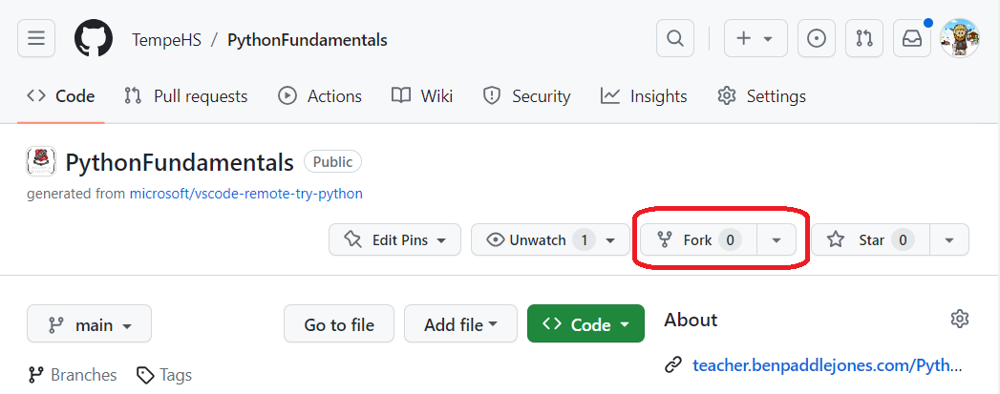
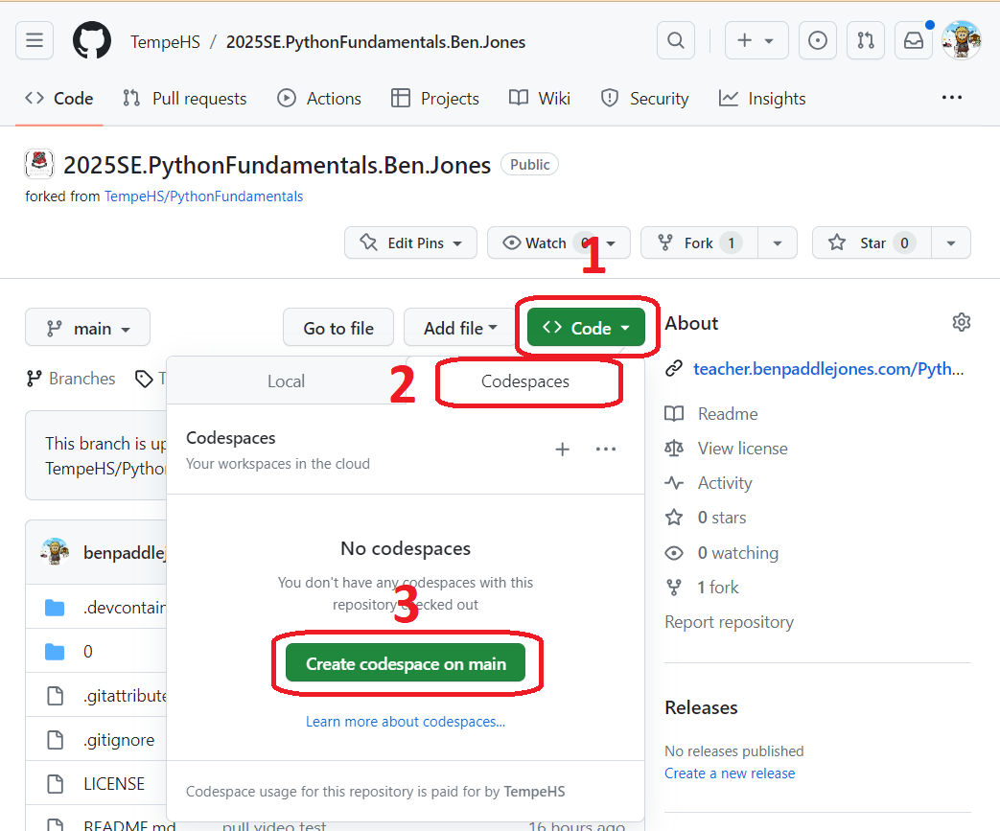
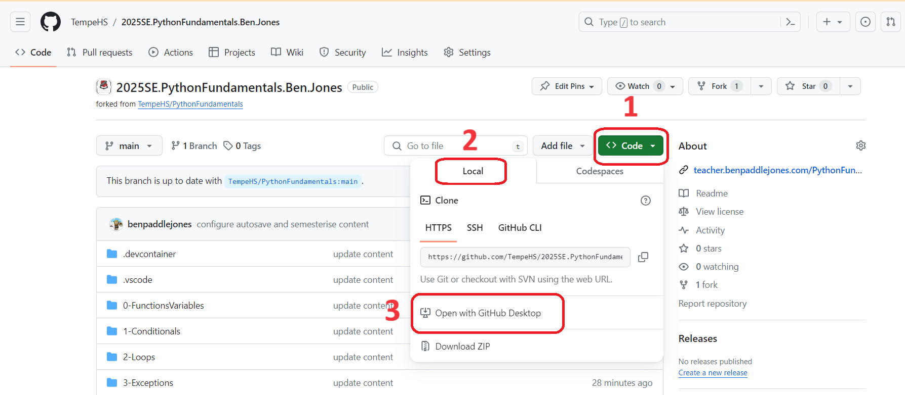

# Python Fundamentals
## Lectures - Term 1
1. [Functions & Variables](0-FunctionsVariables/0-FunctionsVariables.md)
2. [Conditionals](1-Conditionals/1-Conditionals.md)
3. [Loops](2-Loops/2-Loops.md)
4. [Debugging](Debugging/Debugging.md)
5. [Exceptions](3-Exceptions/3-Exceptions.md)
6. [Libraries](4-Libraries/4-Libraries.md)
7. [File IO](6-FileIO/6-FileIO.md)

## Lectures - Term 2
1. [Unit Tests](5-UnitTests/5-UnitTests.md)
2. [Object Oriented Paradigm](8-OOP/8-OOP.md)

## Lectures - Optional
1. [Regular Expressions](7-RegularExpressions/7-RegularExpressions.md)
2. [Et Cetera](9-EtCetera/9-EtCetera.md)

---

# Commonly used commands
## Bash Commands 
1. `clear` clear the terminal window
2. `ls` list files and folders in the active folder
3. `cp [source name] [destination name]` copy a file or folder, example `cp hello.py goodbye.py` copies the file `hello.py` and saves it as `goodbye.py`
4. `mv [target file] [new name]` rename a file or folder, example `mv hello.py hi.py` renames the file `hello.py` to `hi.py`
5. `rm [target file]` removes (deletes) the target file, example `rm hi.py`
6. `mkdir [name]` makes a new folder (directory), example `mkdir myFolder`
7. `rmdir [child folder name]` removes a child folder (directory) of the active folder, example `rmdir myFolder`
7. `cd [child folder name] changes the active folder, example `cd myFolder`
8. `..` move to the parent folder, example `cd ..`moves the active folder to the parent folder

## Python Commands
1. `code hello.py` create a python file call **hello** and begin coding into the file
2. `python hello.py` execute the python program

## Git commands
1. Pull latest code from the repository

		git pull
2. Add indoor.py to the changes to be committed

		git add [file name]
3. Add all chnaged files to the changes to be committed

		git add -A
3. Commit all changes in the REPO with comments

		git commit -m “My comment“
4. Push all changes to the REPO

		git push 

# How to setup your workspace
1. Fork this repository

2. Correctly name your new reposity

3. Open either a virtual or local itegrated developer environment
- Run a virtual codespace

_Wait until you see the README.md so your CodeSpace is fully configured_
- Run a local Visual Code

_Make sure all extensions have loaded_

